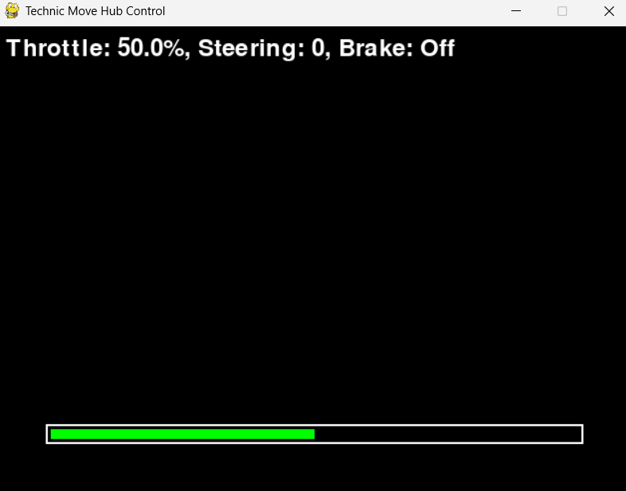

# Keyboard-Control-for-LEGO-Technic-Porsche-GT4-e-Performance-
Control the Lego Porsche GT4 with your keyboard and a computer!

Credits to Daniele Benedettelli's code for controlling the Porsche's Hub using a Xbox controller in the TechnicMoveHub repository. 

[Xbox Hub Controller code](https://github.com/DanieleBenedettelli/TechnicMoveHub/blob/main/LEGO%20Technic%2042176%20XBOX%20RC.py)

[TechnicMoveHub repository](https://github.com/DanieleBenedettelli/TechnicMoveHub/tree/main)

Credits to ChatGPT as well for helping me code this

# Usage: 

# Python:

Make sure to install pygame, bleak and asyncio
Older computers may not support BLE, which is used to communicate to the hub. If you are unsure that your computer supports BLE, just run BLEtest.py.
While the program is searching for the hub, make sure to press the button on the hub, it should start flashing and allow the computer to connect.

# An exe version of this program will be coming out soon

# How to control the car
Make sure to click on the pygame window.
It should look like this:

# Throttle:

Use the bar to choose the (throttle) speed limit:
At the top left of the window, it will show the speed percentage
Use W to accelerate and the Spacebar to brake
Use S to reverse

# Steering:

Use A to steer left and D to steer right
The longer you hold the button, the higher the turning angle will be. 
As soon as you let go of the button, the steering will reset.

# Lights and Battery

Sadly, I haven't figured out how to control the lights and read the battery percentage
I am open to any suggestions or methods on how to do these things

